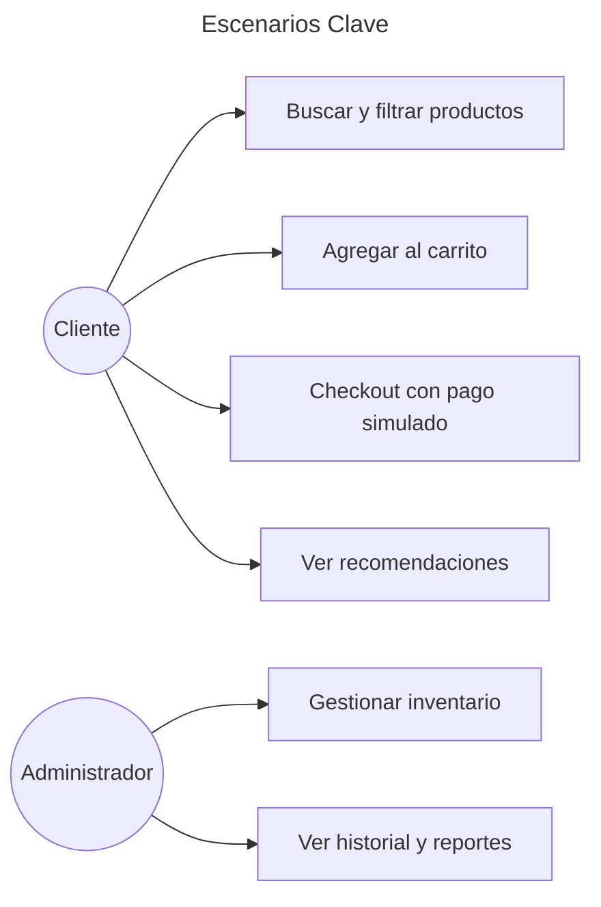
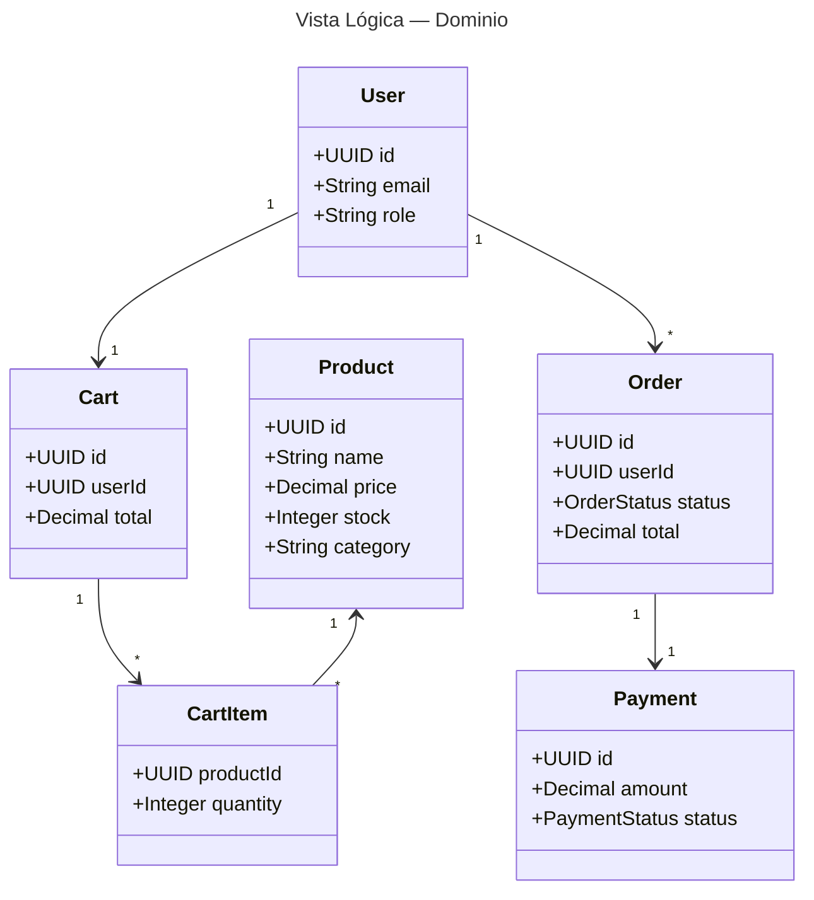
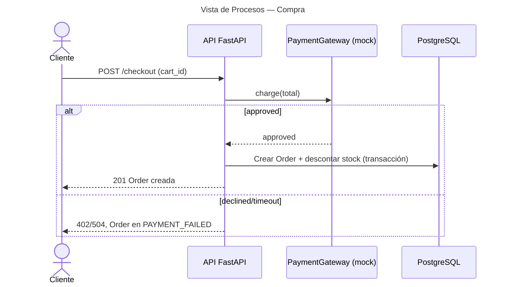
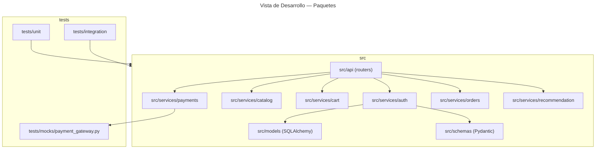
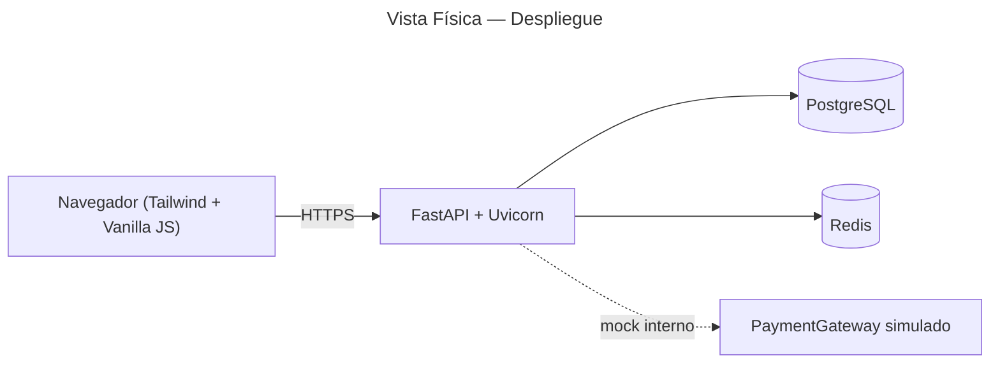

# 🏛️ Arquitectura — Modelo 4+1 (Krutchen)

**Fecha:** 2026-10-06
**Estado:** Borrador

---

## 1. Vista de Escenarios (+1)

Casos de uso principales que guían el diseño:

## 2. Vista Lógica

Módulos del dominio y sus relaciones principales:

## 3. Vista de Procesos

Flujo del negocio de compra (async request/response, workers opcionales):

## 4. Vista de Desarrollo

Organización del código (módulos, capas, tests):

## 5. Vista Física

Despliegue cloud único:

---

## Decisiones Clave

| Decisión | Justificación |
|----------|---------------|
| FastAPI + Pydantic | Tipado, validación y OpenAPI automático |
| PostgreSQL | Consistencia ACID para pedidos e inventario |
| Redis | Caché de recomendaciones (TTL 5 min) y lista negra JWT |
| Pasarela mockeada | Restricción del proyecto: `tests/mocks/payment_gateway.py` |
| Vanilla JS + Tailwind | Sin frameworks pesados de frontend |

Diagramas UML de referencia: `docs/uml/use-cases.md`, `checkout-sequence.md`, `components-mvc.md`, `deployment.md`.
