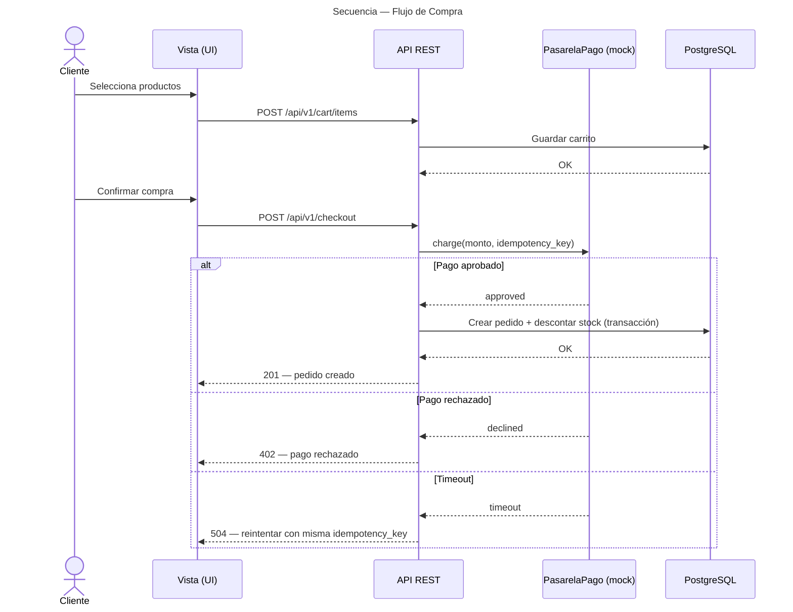

# 🔄 Secuencia — Flujo de Compra (Checkout)

```mermaid
---
title: Secuencia — Flujo de Compra
---
sequenceDiagram
    actor C as Cliente
    participant V as Vista (UI)
    participant API as API REST
    participant P as PasarelaPago (mock)
    participant DB as PostgreSQL

    C->>V: Selecciona productos
    V->>API: POST /api/v1/cart/items
    API->>DB: Guardar carrito
    DB-->>API: OK
    C->>V: Confirmar compra
    V->>API: POST /api/v1/checkout
    API->>P: charge(monto, idempotency_key)
    alt Pago aprobado
        P-->>API: approved
        API->>DB: Crear pedido + descontar stock (transacción)
        DB-->>API: OK
        API-->>V: 201 — pedido creado
    else Pago rechazado
        P-->>API: declined
        API-->>V: 402 — pago rechazado
    else Timeout
        P-->>API: timeout
        API-->>V: 504 — reintentar con misma idempotency_key
    end
```
