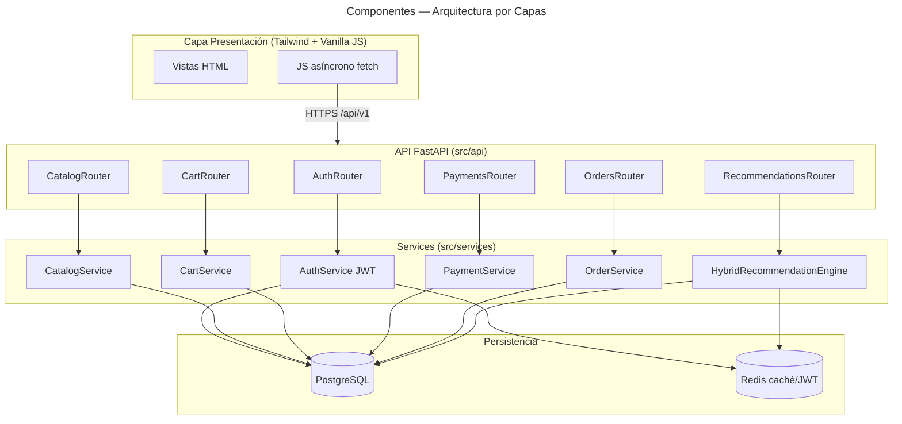

# 🧩 Componentes — Arquitectura en Capas

```mermaid
---
title: Componentes — Arquitectura por Capas
---
flowchart TB
    subgraph Presentacion["Capa Presentación (Tailwind + Vanilla JS)"]
        V1[Vistas HTML]
        V2[JS asíncrono fetch]
    end
    subgraph API["API FastAPI (src/api)"]
        R1[AuthRouter]
        R2[CatalogRouter]
        R3[CartRouter]
        R4[PaymentsRouter]
        R5[OrdersRouter]
        R6[RecommendationsRouter]
    end
    subgraph Servicios["Services (src/services)"]
        S1[AuthService JWT]
        S2[CatalogService]
        S3[CartService]
        S4[PaymentService]
        S5[OrderService]
        S6[HybridRecommendationEngine]
    end
    subgraph Datos["Persistencia"]
        M1[(PostgreSQL)]
        M2[(Redis caché/JWT)]
    end
    V2 -->|HTTPS /api/v1| API
    R1 --> S1
    R2 --> S2
    R3 --> S3
    R4 --> S4
    R5 --> S5
    R6 --> S6
    S1 --> M1
    S1 --> M2
    S2 --> M1
    S3 --> M1
    S4 --> M1
    S5 --> M1
    S6 --> M1
    S6 --> M2
```
