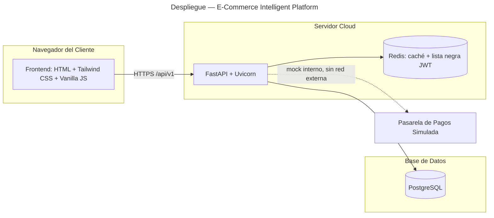

# 🚀 Despliegue

```mermaid
---
title: Despliegue — E-Commerce Intelligent Platform
---
flowchart LR
    subgraph ClienteWeb["Navegador del Cliente"]
        FE["Frontend: HTML + Tailwind CSS + Vanilla JS"]
    end
    subgraph Servidor["Servidor Cloud"]
        API["FastAPI + Uvicorn"]
        REDIS[("Redis: caché + lista negra JWT")]
    end
    subgraph Datos["Base de Datos"]
        DB[("PostgreSQL")]
    end
    FE -->|HTTPS /api/v1| API
    API --> DB
    API --> REDIS
    API -.->|mock interno, sin red externa| PG["Pasarela de Pagos Simulada"]
```
